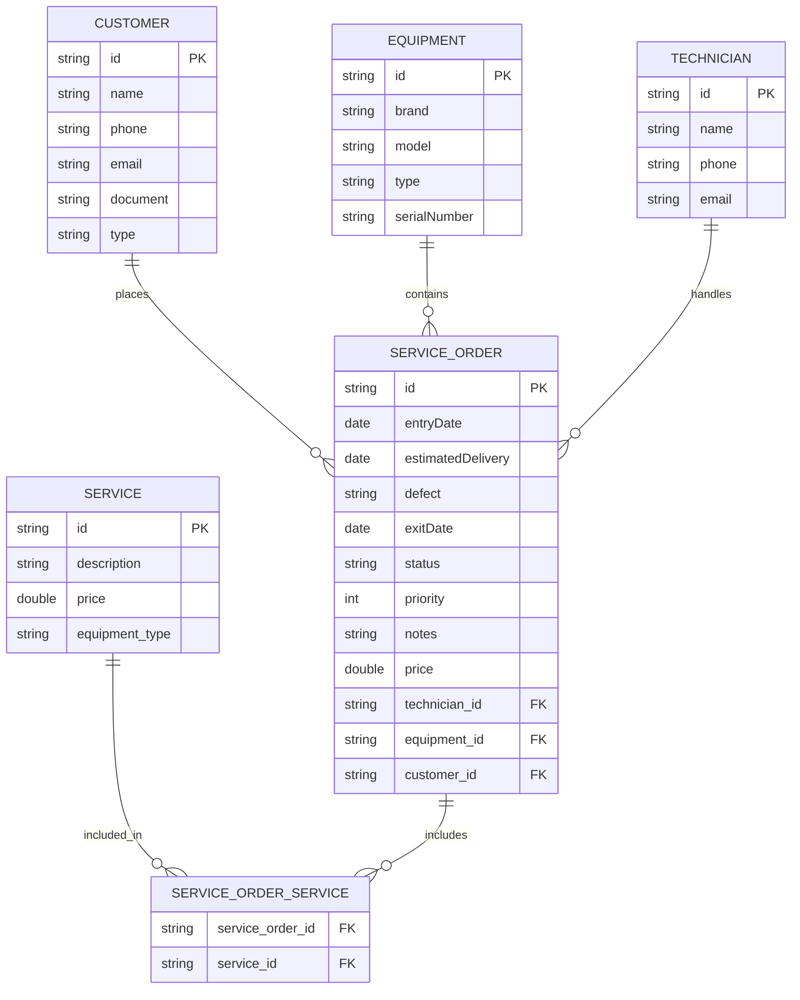

# Technical Assistance API

A **Technical Assistance API** é um sistema de software projetado para o gerenciamento completo das operações de uma empresa de assistência técnica. A plataforma centraliza o controle de equipamentos, clientes, técnicos, catálogo de serviços e ordens de serviço, otimizando o fluxo de trabalho e a organização interna.

Este projeto foi desenvolvido como trabalho de conclusão da imersão **Java.Xpert da FIAP (Shift)** e representa a aplicação prática dos conhecimentos adquiridos ao longo do curso, abrangendo disciplinas como:

-   **Computational Thinking & Domain-Driven Design (DDD):** Na modelagem estratégica e tática do domínio.
-   **Banco de Dados:** Na estruturação e persistência relacional dos dados.
-   **Spring Framework:** Na construção de uma API RESTful segura, eficiente e escalável.
-   **Integração Web:** Na conexão da API com uma interface de usuário.

 ## 🏗️ Arquitetura

A API foi estruturada seguindo uma **simplificação da Clean Architecture**. Essa abordagem, embora abstraia parte da complexidade do padrão original, garante o **desacoplamento** entre as regras de negócio e os detalhes de infraestrutura (web, banco de dados). O resultado é um código com maior organização, testabilidade e manutenibilidade.

A estrutura de pacotes é a seguinte:

-   📦 **`core`**: O centro da aplicação.
    -   **`business`**: Contém a **lógica de negócio** e orquestra as operações da aplicação (ex: criar um cliente, finalizar uma ordem de serviço).
    -   **`service`** (interfaces): Definem os **contratos** para as operações de infraestrutura, como a persistência de dados (`salvarCliente`, `buscarClientePorId`).
    -   **`domain`**: Onde residem as **Entidades** de negócio puras.

-   📦 **`entrypoint`**: A porta de entrada da API.
    -   Contém os **Controllers**, que recebem as requisições e as direcionam para a camada **`business`**.
    -   Contém os **DTOs** (Data Transfer Objects) para os dados de entrada e saída.

-   📦 **`resources`**: A camada de infraestrutura que implementa os detalhes técnicos.
    -   **`service`** (implementações): Implementação concreta das interfaces definidas no `core`, interagindo com os **Repositories** para manipular os dados.
    -   **`database`**: Onde ficam as **Entities** (mapeamento para o banco) e os **Repositories** (Spring Data).

-   📦 **`common`** e **`config`**: Pacotes de suporte com classes utilitárias (**Mappers**, **Exceptions**) e configurações gerais do Spring (**Web**, **OpenAPI**).


## ⚙️ Funcionalidades

A **Technical Assistance API** oferece um conjunto completo de operações para o gerenciamento de uma assistência técnica, cobrindo as seguintes entidades:

* **Clientes:** Cadastro de novos clientes, listagem de todos os registros, consulta por ID, atualização de dados e exclusão. Também é possível listar todas as ordens de serviço associadas a um cliente específico.
* **Técnicos:** Criação de novos perfis de técnicos, listagem completa, consulta por ID, atualização e exclusão. Adicionalmente, a API permite listar todas as ordens de serviço sob a responsabilidade de um técnico.
* **Equipamentos:** Cadastro de novos equipamentos vinculados a um cliente, listagem de todos os equipamentos, consulta por ID, atualização de informações e exclusão. Permite também listar o histórico de ordens de serviço de um equipamento.
* **Serviços:** Gerenciamento do catálogo de serviços oferecidos, incluindo criação, listagem de todos os serviços, consulta por ID, atualização e exclusão. Também é possível verificar quais ordens de serviço utilizaram um determinado serviço.
* **Ordens de Serviço:** Criação de novas ordens de serviço, listagem completa, consulta detalhada por ID, atualização e exclusão. O sistema também oferece:
    * **Gerenciamento de Status:** Ações específicas para iniciar, cancelar e completar uma ordem de serviço, controlando seu ciclo de vida.
    * **Visualização Simplificada:** Endpoints otimizados para exibir os dados em formato de tabela, incluindo uma função de busca de ordens pelo nome do cliente.

## 🔗 Diagrama de Entidades



## 💻 Tecnologias Utilizadas

Abaixo estão as principais tecnologias e bibliotecas utilizadas no desenvolvimento da API:

| Tecnologia | Versão | Descrição |
| :--- | :--- | :--- |
| [**Java**](https://www.oracle.com/java/technologies/downloads/#java21) | 21 | Linguagem de programação principal. |
| [**Spring Boot**](https://spring.io/projects/spring-boot) | 3.5.5 | Framework principal para a construção da aplicação. |
| [**Spring Data JPA**](https://spring.io/projects/spring-data-jpa) | - | Facilita a implementação da camada de persistência de dados. |
| [**MySQL**](https://www.mysql.com/downloads/) | - | Banco de dados relacional utilizado no projeto. |
| [**Flyway**](https://flywaydb.org/) | - | Ferramenta para versionamento e migração de schema de banco de dados. |
| [**SpringDoc OpenAPI**](https://springdoc.org/) | 2.7.0 | Geração automática de documentação da API no padrão Swagger/OpenAPI. |
| [**Lombok**](https://projectlombok.org/) | - | Biblioteca para reduzir código boilerplate (getters, setters, construtores). |
| [**Maven**](https://maven.apache.org/download.cgi) | - | Gerenciador de dependências e build do projeto. |

## 🚀 Como Executar o Projeto

Siga os passos abaixo para executar a API localmente.

### Pré-requisitos

Antes de começar, você vai precisar ter instalado em sua máquina:
* [JDK 21](https://www.oracle.com/java/technologies/downloads/#java21) ou superior
* Um servidor de banco de dados [MySQL](https://www.mysql.com/downloads/) rodando localmente

### 1. Clonar o Repositório

```bash
git clone https://github.com/guilherme-eira/technical-assistance-api.git
cd technical-assistance-api
```

### 2. Configurar o Banco de Dados

1. Abra o terminal e conecte-se ao MySQL (será pedida a senha):

    ```bash
    mysql -u seu_usuario -p
    ```
2. No prompt do MySQL, execute o comando:

    ```sql
    CREATE DATABASE technical_assistance_db;
    ```
3. Para confirmar que o banco foi criado, use:

    ```sql
    SHOW DATABASES;
    ```
Agora o banco de dados `technical_assistance_db` está pronto para ser usado pela aplicação.

### 3. Configurar o `application.properties`

Dentro do diretório `src/main/resources`, crie ou edite o arquivo `application.properties`. Você tem duas opções para configurar a conexão com o banco de dados:

#### a) Configuração direta
Substitua os valores pelas suas credenciais do MySQL:

```properties
# URL de conexão com o seu banco de dados MySQL
spring.datasource.url=jdbc:mysql://localhost:3306/technical_assistance_db

# Usuário do banco de dados
spring.datasource.username=seu_usuario_aqui

# Senha do banco de dados
spring.datasource.password=sua_senha_aqui

# Driver do MySQL
spring.datasource.driver-class-name=com.mysql.cj.jdbc.Driver

# Configurações do Hibernate/JPA
spring.jpa.show-sql=true
spring.jpa.properties.hibernate.format-sql=true
server.error.include-stacktrace=never
```
#### b) Usando variáveis de ambiente (recomendado)
Você também pode deixar o arquivo genérico e configurar as credenciais via variáveis de ambiente, substituindo os valores diretos por placeholders:

```properties
spring.datasource.url=${DB_URL}
spring.datasource.username=${DB_USER}
spring.datasource.password=${DB_PASSWORD}
spring.datasource.driver-class-name=com.mysql.cj.jdbc.Driver
spring.jpa.show-sql=true
spring.jpa.properties.hibernate.format-sql=true
server.error.include-stacktrace=never
```
Nesse caso, você precisa definir as variáveis de ambiente no seu sistema:

- **DB_URL** → URL do banco de dados (jdbc:mysql://localhost:3306/technical_assistance_db)
- **DB_USER** → Usuário do MySQL
- **DB_PASSWORD** → Senha do MySQL

### 4. Executar a Aplicação

Como o Maven já vem embutido via Spring Boot, você pode executar a aplicação diretamente pela IDE:

- **IntelliJ:** clique com o botão direito na classe principal `TechnicalAssistanceApplication` e selecione **Run**.
- **Eclipse:** clique com o botão direito na classe principal e selecione **Run As → Spring Boot App**.

Alternativamente, você pode rodar no terminal usando Maven Wrapper:

```bash
./mvnw spring-boot:run
```

A API estará rodando em ```http://localhost:8080```.

## 🔬 Rodando os Testes Unitários

O projeto possui uma suíte de testes unitários para garantir a qualidade e o funcionamento correto das regras de negócio e da lógica da aplicação. Os testes estão localizados no diretório `src/test/java`.

Você pode executar os testes de duas formas:

### 1. Pelo Terminal (usando Maven Wrapper)

Este comando executa a suíte de testes completa. Navegue até a raiz do projeto e execute:
```bash
./mvnw test
```
O Maven irá compilar o código, executar todos os testes e, ao final, exibirá um resumo no console. Se tudo estiver correto, você verá uma mensagem de `BUILD SUCCESS`.

### 2. Pela IDE

Executar os testes pela IDE é ideal para rodar um teste específico ou para depurar o código.

**IntelliJ:** Clique com o botão direito no diretório `src/test/java` (ou em uma classe de teste específica) e selecione Run 'All Tests'. Você também pode usar o ícone de "play" ao lado da definição da classe ou do método de teste.

**Eclipse:** Clique com o botão direito no diretório `src/test/java` (ou em uma classe de teste específica) e selecione **Run As → JUnit Test**.

## 🧪 Como Testar a Aplicação

Após iniciar a aplicação, você pode interagir e testar todos os endpoints de duas maneiras principais:

### 1. Swagger UI (Documentação Interativa)

A API gera automaticamente uma documentação interativa com o Swagger UI, que permite não apenas visualizar, mas também executar os endpoints.

1.  Com a aplicação rodando, acesse o seguinte endereço no seu navegador:
    ```
    http://localhost:8080/swagger-ui.html
    ```
2.  Você verá uma página com todos os endpoints agrupados por controlador (`Clientes`, `Ordens de Serviço`, etc.).
3.  Clique em qualquer endpoint para ver detalhes, como os parâmetros necessários, o formato do corpo da requisição e os possíveis códigos de resposta.
4.  Você pode preencher os campos e clicar em **"Execute"** para fazer uma chamada real à API diretamente do seu navegador.

### 2. Postman Collection

Para esta forma de teste, é necessário ter o aplicativo **[Postman](https://www.postman.com/downloads/)** instalado.

O projeto também inclui uma collection com requisições prontas para todos os endpoints. Ela é ideal para testes mais elaborados e para popular o banco de dados com dados de exemplo.

1.  **Localize o arquivo:** O arquivo da collection está na pasta do projeto, em `src/main/resources/postman/technical-assistance-api.postman_collection.json`.

2.  **Importe no Postman:**
    -   Abra o seu aplicativo Postman.
    -   Clique em **Import** (no canto superior esquerdo).
    -   Selecione o arquivo JSON da collection no seu diretório local.

3.  **Execute as requisições:**
    -   Após a importação, uma nova collection aparecerá na sua área de trabalho do Postman.
    -   Agora você pode abrir as pastas (`Clientes`, `Técnicos`, etc.) e executar as requisições pré-configuradas para testar a API.

### 3. Interface Visual

Conforme proposto no escopo do projeto, foi realizada a integração da API com uma interface front-end desenvolvida com **HTML, JavaScript e Bootstrap**.

A interface consome os endpoints da API e permite executar as principais operações relacionadas às **Ordens de Serviço**, como a criação, listagem, atualização e gerenciamento de status de forma visual.

O projeto front-end está em um repositório separado. Para acessá-lo e obter as instruções de execução, utilize o link abaixo:

-   **[Acessar Repositório do Front-End](https://github.com/guilherme-eira/technical-assistance-front-end)**
